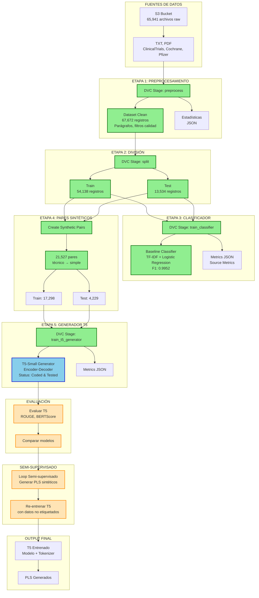
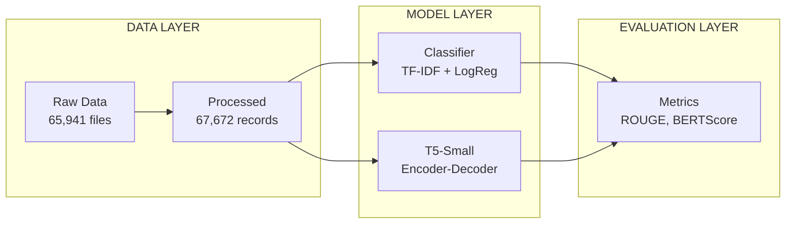

# Arquitectura del Proyecto: PLS Biomédico



## Componentes Implementados

1. **Pipeline DVC** (3 stages completados)
2. **Preprocesamiento** (67K registros limpios)
3. **Clasificador Baseline** (F1: 0.9952)
4. **Generador de Pares Sintéticos** (21K pares)
5. **T5-Small** (Código verificado, listo para GPU)

## Componentes Pendientes

1. **Evaluación** (ROUGE, BERTScore)
2. **Bucle Semi-supervisado**
3. **Refinamiento**
4. **Dashboard Streamlit**

## Pipeline DVC Actual

```yaml
stages:
  preprocess          → dataset_clean.csv (67,672 registros)
  split               → train.csv, test.csv
  train_classifier    → classifier.pkl (F1: 0.9952)
  train_t5_generator  → T5 model (entrenado en Colab)
  evaluate            → Métricas finales
  semi_supervised     → Iteración con datos no etiquetados
```

## Arquitectura de Componentes



## Stack Tecnológico

```
┌──────────────────────────────────────────┐
│ Python 3.11                              │
│ - Pandas, NumPy                          │
│ - scikit-learn (TF-IDF, LogReg)          │
│ - Transformers (T5)                      │
│ - PyTorch                                │
└──────────────────────────────────────────┘
┌──────────────────────────────────────────┐
│ DVC (Data Version Control)               │
│ - Pipeline: YAML                         │
│ - Cache: Local                           │
│ - Remote: S3                             │
└──────────────────────────────────────────┘
┌──────────────────────────────────────────┐
│ AWS S3                                   │
│ - Raw data: 65,941 files                 │
│ - Storage: GBs                           │
└──────────────────────────────────────────┘
┌──────────────────────────────────────────┐
│ Google Colab (Planificado)               │
│ - GPU: T4                                │
│ - T5 Fine-tuning                         │
└──────────────────────────────────────────┘
```

## Flujo de Datos Completo

```
1. DVC pull           → Descargar raw de S3
2. make_dataset.py    → Limpiar y normalizar
3. split_dataset.py    → Dividir train/test
4. train_classifier   → Clasificar PLS/non_PLS
5. create_pairs       → Generar pares sintéticos
6. train_t5          → Entrenar generador
7. evaluate          → Evaluar con métricas
8. semi_supervised   → Iteración con no etiquetados
```

## Estado del Proyecto

```
┌─────────────────────────────────────────────────┐
│ Semana 0: Setup                                 │
│ - DVC configurado                               │
│ - S3 conectado                                  │
│ - Datos subidos                                 │
└─────────────────────────────────────────────────┘
┌─────────────────────────────────────────────────┐
│ Semana 1: Preprocesamiento                      │
│ - EDA completo                                  │
│ - 67K registros limpios                         │
│ - Split train/test                              │
└─────────────────────────────────────────────────┘
┌─────────────────────────────────────────────────┐
│ Semana 2: Clasificador                          │
│ - Baseline: F1 0.9952                           │
│ - Target cumplido                               │
└─────────────────────────────────────────────────┘
┌─────────────────────────────────────────────────┐
│ Semana 3: Generador                             │
│ - Pares sintéticos generados                    │
│ - T5 código implementado                        │
│ - T5 entrenado en Colab                         │
└─────────────────────────────────────────────────┘
┌─────────────────────────────────────────────────┐
│ Semana 4-6: Finalización                        │
│ - Evaluación completa                           │
│ - Análisis de resultados                        │
│ - Documentación                                 │
└─────────────────────────────────────────────────┘
```
